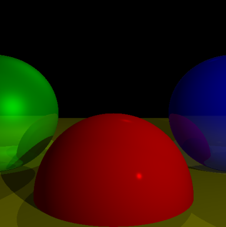

#

<p align="center">
  
</p>

A simple Ray Tracer built with python, inspired by and based on [Gabriel Gambetta](https://github.com/ggambetta)'s awesome [book](https://www.gabrielgambetta.com/computer-graphics-from-scratch/#part-i:-raytracing).

## Example Usage

```python
from ray_tracer.frame import Canvas

canvas = Canvas(height=400, width=400)
canvas.add_sphere(centre=[0, -1, 3], radius=1, color=[1, 0, 0], specular=500, reflective=0.2)
canvas.add_sphere(centre=[2, 0, 4], radius=1, color=[0, 0, 1], specular=500, reflective=0.3)
canvas.add_sphere(centre=[-2, 0, 4], radius=1, color=[0, 1, 0], specular=10, reflective=0.4)
canvas.add_sphere(centre=[0, -5001, 0], radius=5000, color=[1, 1, 0], specular=1000, reflective=0.5)

canvas.add_light(type="ambient", intensity=0.2)
canvas.add_light(type="point", intensity=0.6, position=(2, 1, 0))
canvas.add_light(type="directinal", intensity=0.2, direction=(1, 4, 4))

canvas.render()
```
